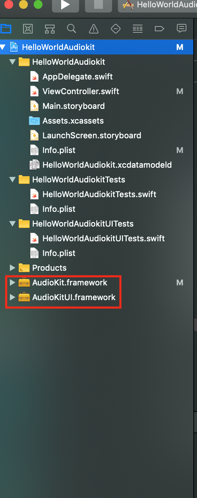

# AudioKitHelloWorld

Welcome! If you are watching my AudioKit Basic Oscillator Tutorial on YouTube, you've come to the right place! These are final project Swift files for your reference to double check your code after you finish your project. Enjoy!

## Original Article Where Project Came From:
[AudioKit Examples - Hello World](https://audiokit.io/examples/HelloWorld/)

# PLEASE NOTE:

### This github repository contains only the code for the project, not the full project itself.

### If you are interested in downloading the full project, please download the release package and unarchive it:
[Download Release]()

## Needed Frameworks to Compile This Project in Xcode
Go to the official Audio Kit Website - [audiokit.io/downloads](https://audiokit.io/downloads)
Click on the AudioKit-iOS-{VERSION}.zip link to download the latest version of AudioKit frameworks
Go to your downloads folder and unzip the file "AudioKit-iOS-{VERSION}.zip"
Click on the new folder called "AudioKit-iOS"
Once the folder is open, copy the files "AudioKit.framework" and "AudioKitUI.framework" into your Xcode Project and make sure that you check the box next to "Copy items if needed" when prompted. Then click "Finish."

# Still getting errors when you try to build the project?
## Here are a few common ones:
### Swift Compiler Error
#### No such module 'AudioKit'
##### 1. Make sure the required AudioKit Frameworks listed above are inside of your project and your project source folder.

