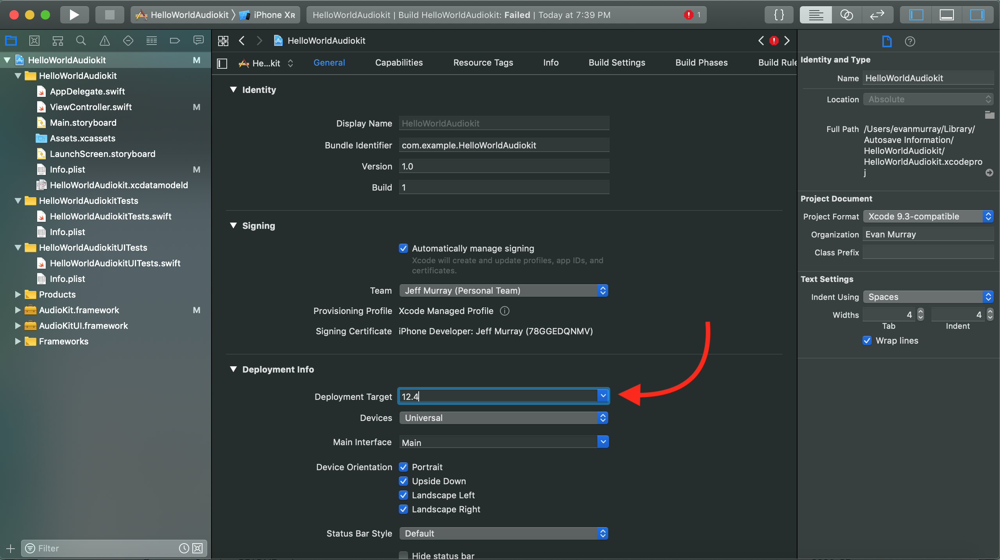

# AudioKitHelloWorld

Welcome! If you are watching my AudioKit Basic Oscillator Tutorial on YouTube, you've come to the right place! These are final project Swift files for your reference to double check your code after you finish your project. Enjoy!

## Original Article Where Project Came From:
[AudioKit Examples - Hello World](https://audiokit.io/examples/HelloWorld/)

# PLEASE NOTE:

### This github repository contains only the code for the project, not the full project itself.

### If you are interested in downloading the full project, please download the release package and unarchive it:
[Download Release]()

## Needed Frameworks to Compile This Project in Xcode
Go to the official Audio Kit Website - [audiokit.io/downloads](https://audiokit.io/downloads)
Click on the AudioKit-iOS-{VERSION}.zip link to download the latest version of AudioKit frameworks
Go to your downloads folder and unzip the file "AudioKit-iOS-{VERSION}.zip"
Click on the new folder called "AudioKit-iOS"
Once the folder is open, copy the files "AudioKit.framework" and "AudioKitUI.framework" into your Xcode Project and make sure that you check the box next to "Copy items if needed" when prompted. Then click "Finish."

# Still getting errors when you try to build the project?
## Here are a few common ones:
### Swift Compiler Error
#### No such module 'AudioKit'
##### 1. Make sure the required AudioKit Frameworks listed above are inside of your project editor and your project source folder.

Project Editor            |  Source Folder
:-------------------------:|:-------------------------:
  |  

##### 2. Make sure both frameworks are added under the "Linked Frameworks and Libraries" section.

##### 3. Delete this line and retype it. Then, press and release the (Command + Shift + K) keys at the same time to clean your project.

### Error
#### Undefined symbol:
##### Don't forget to include the C++ linker flag! We need to compile some C++ code which is in the AudioKit frameworks!
##### 1. Under the "Linking" section, click on "Other Linker Flags" and press enter/return

##### 2. Enter the following string: "-lc++"

##### 3. Press enter/return again

##### 4. It should look like this:

##### 5. Clean your project (Shift + Command + K) and try running it again. It should work this time.

### Swift Compiler Error
#### Compiling for iOS x.x, but module 'AudioKit' has a minimum deployment target of iOS x.x: /Users/username/Library/Autosave Information/HelloWorldAudiokit/AudioKit.framework/Modules/AudioKit.swiftmodule/x86_64.swiftmodule

##### 1. Set the deployment target to the latest iOS version possible

### Swift Compiler Error
#### Swift x.x module cannot be used with Swift x.x (earlier version)
##### 1. Make sure you have the latest version of Xcode installed. If not, either download it or update it if you already have it.
##### 2. Download the latest version of the AudioKit frameworks to use in your project [here](https://audiokit.io/downloads)

## Other questions?
### Please feel free to reach out to me or someone else in the AudioKit community, and we will do our best to help!
### Keep your eye out for the next tutorial!

